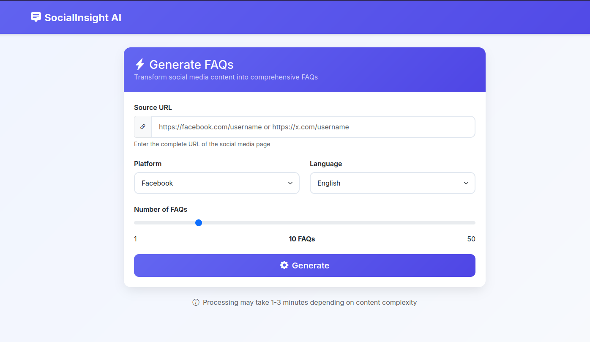

<h1>SocialInsight AI - FAQ Generator 🚀</h1>

A powerful Flask application that transforms social media content into comprehensive Frequently Asked Questions (FAQs) using AI-powered scraping and natural language processing.

   



<h3>✨ Features</h3>

  🌐 Multi-Platform Support: Facebook, Instagram, X (Twitter), and more
  
  🌍 Multi-Language: Support for 8 languages (English, Vietnamese, French, Spanish, German, Chinese, Japanese, Korean)
  
  🤖 AI-Powered: Uses LLM API for intelligent FAQ generation
  
  ⚡ Real-time Processing: Background processing with progress tracking
  
  🎨 Modern UI: Professional, responsive web interface

<h3>🚀 Quick Start</h3>

<h4>🔧 Installation</h4>

Clone the repository
```
git clone https://github.com/trongkhanh083/faq_generator.git
cd faq_generator
```

Python dependencies
```
pip install -r requirements.txt
```

Playwright browsers
```
playwright install
```
Create environment variables .env:
```
MISTRAL_API_KEY=your_mistral_api_key_here
(other api key that you want)
```

Start development server
```
python app.py
```

  

SocialInsight AI - Transforming social content into actionable knowledge. 🚀

Made with ❤️ for the open source community
